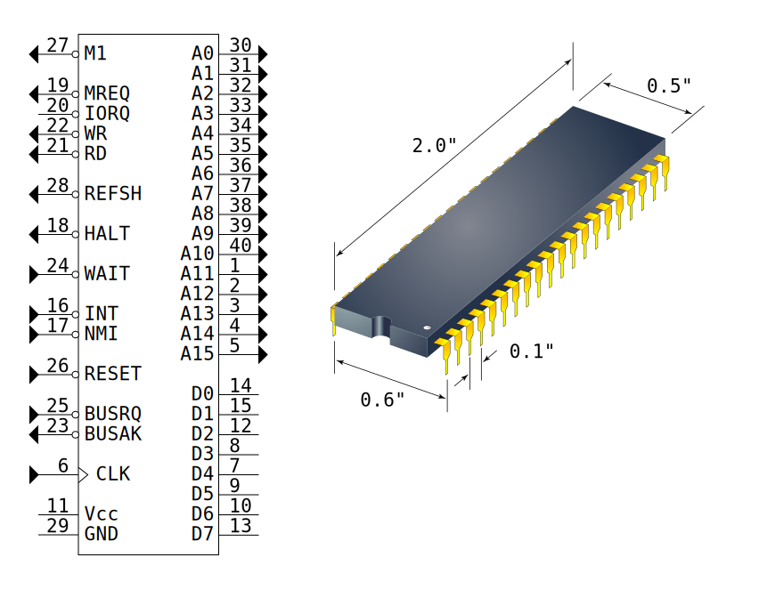
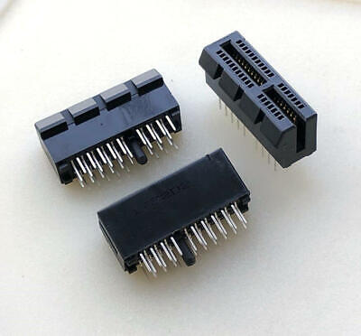

# The start of Az8muth

## The plan

What is the Az8muth? It is my custom designed Z80 computer. There are plenty of Z80 computers out there. But, I wanted to design my own.

The closest to my concept is the [RC2014](https://rc2014.co.uk/). But I will do things differently. My focus will be on hardware interfacing, not on making a "PC". So you generally see that the priority for these systems is adding keyboard and display support. As well as running CP/M. But that isn't directly my goal.

One of my end goals would be to have "odd" hardware that it can interface with. I would love to have a custom punch tape reader and maybe even puncher.

Now, to have a list:

* Based of the Z80 cpu, as this is a well known chip, relatively powerful. I'm familiar enough with the assembly to program it. And not that hard to source.
* Backplane based design. To easier swap out and customize parts.
* Ideally, no usage of modern microcontrollers/FPGAs, but instead use 7400 series logic chips, and through hole parts where possible.

## Core design: Backplane, CPU, memory

One of the things we need to decide early on, is what to put on the backplane. The backplane will be a bus that connects different cards together.

Now, the Z80 has 40 pins as shown above. There are a whole bunch of pins that are essential: 16 address pins, 8 data pins, WR/RD/MREQ/IORQ are all required for bus communication between boards. VCC and GND are ofcourse also essential.
So that quickly becomes 30 pins that are already required. We'll want some more pins for interrupts, and bus requests. But that gives a general idea of how wide the bus needs to be.

So, connectors. There are MANY, MANY types of connectors in this world. If you go searching for connectors, you can go completely wild. But, a simple choice would be common 2.5mm pin headers. These are used on the RC2014, easy available, and can be any size you want. Disadvantage is that they are easy to plug in wrong. You can flip them or offset them by a pin. Pins also bend easy.

After searching around. I came across a connector I liked. And it's this:

It's a 38 pin PCI Express 1 lane connector. It's reasonable easy to source. It provides the amount of pins we need. And we only need to source connectors for the backplane, making experimenting with different boards easier and cheaper. It's also nice and compact, and can be expanded to 64pins with a 2 lane connector.

Disadvantages are that 36 does not cover all 40 pins of the Z80. And that getting all the pins connected on the backplane board requires a 4 layer board. However, 4 layer boards are no longer that expensive.

So we need to keep some pins on the CPU board and not on the backplane. The REFSH (DRAM refresh) and M1 pins are easy to skip out on. We do not want to split instruction and data memory, which would need M1, and we do not want to use DRAM which would complicate things and requires the REFSH pin.
NMI is another easy to skip out on, the non-maskable-interrupt would be annoying to deal with in software, so just having INT is fine. Finally we do not need HALT nor CLK. If we keep the clock generation on the CPU board and nothing needs to know of the CPU halted.

So with M1, REFSH, MNI, HALT and CLK removed, we need 35 pins and the connector has 36. So we have 1 spare. Maybe for inter board communication or something. We'll see.

## Backplane v0

Now, first thing to do, is to see if this backplane idea can work. So I made a quick design in KiCad. Couldn't find a footprint for the connector, so made my own. KiCad does have the card edge as connector, so that I could use off-the-shelve.

My connector footprint isn't great yet. But I'm also still waiting for the parts to arrive to see if they match the document I found.

But, as production and shipping takes time. I drew a v0 backplane, which just wires each pin of the PCIe x1 connectors to the same pin of all other connectors. I kept the size within 100mm for cheap jlcpcb production, and added a card edge as well. This should allow me to check if this works from a single board run (which gives 5 boards)

And now we wait...

## Mistake 1

While waiting for the boards to arrive, I already realized my first mistake. And it has to do with BUSRQ and BUSACK. By connecting these just as a connection to all boards, there would be an issue if two boards use BUSRQ.

To use BUSRQ a board will assert BUSRQ, and then wait till BUSACK goes low by the Z80. Then the data bus is free to be used by whoever asserted BUSRQ. The problem is when two boards pull on BUSRQ at the same time. They both will see BUSACK and start using the bus, causing a bus conflict.

One way to prevent this to have only 1 board that can assert BUSRQ, but that is boring. Another way would be to daisy chain BUSACK, and have boards that assert BUSRQ only forward BUSACK when they haven't asserted BUSRQ themselves. But that requires 1 more pin and a change to the backplane.
